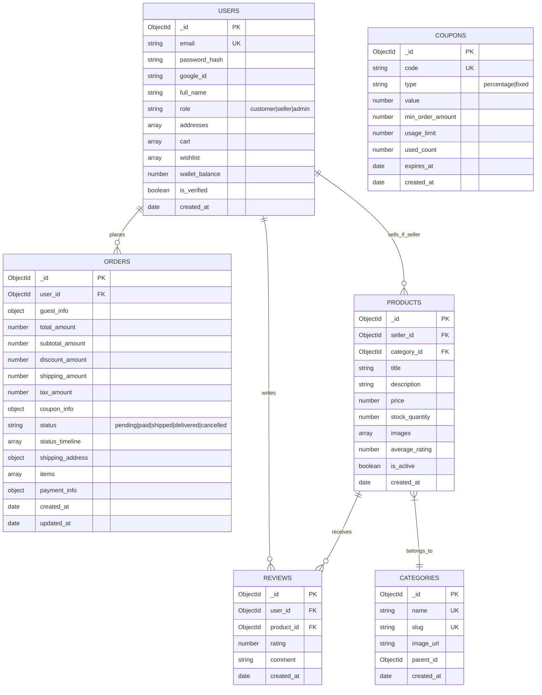
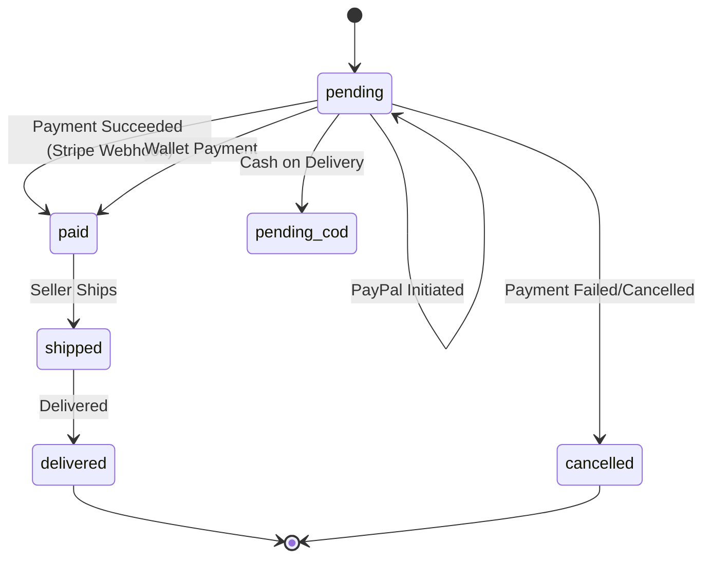

# Entity Relationship Diagram (ERD)

This document outlines the MongoDB collections with their relationships and schemas.

## Relationship Details

| Relationship | Type | Description |
|-------------|------|-------------|
| USERS → ORDERS | One-to-Many | A user can place multiple orders |
| USERS → REVIEWS | One-to-Many | A user can write multiple reviews |
| USERS → PRODUCTS | One-to-Many | A seller can list multiple products |
| PRODUCTS → REVIEWS | One-to-Many | A product can have multiple reviews |
| PRODUCTS → CATEGORIES | Many-to-One | Each product belongs to one category |

## Payment Status Flow

